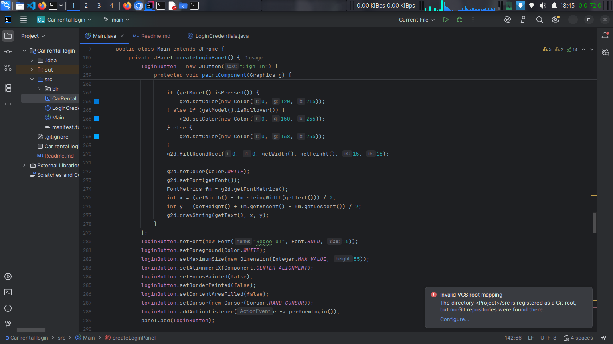

#  Car Rental System Login

## Project Overview

This is a secure login system for a Car Rental Management application built using Java Swing. This project demonstrates Object-Oriented Programming (OOP) principles with a focus on user authentication, security features, and premium UI/UX design.

---

## Key Features

### Security Features
- **Hardcoded Credentials Storage** - Credentials stored in separate `LoginCredentials.java` file
- **Password Masking** - Passwords hidden with custom bullet characters (●)
- **Toggle Visibility** - Eye icon to show/hide password
- **Login Attempt Limiting** - Maximum of 3 login attempts before system lockdown
- **Account Lockout** - Automatic system lock after failed attempts
- **Real-time Validation** - Instant feedback on login attempts


### Logging & Documentation
- **Console Logging** - Each login attempt logged to console
- **Comprehensive Comments** - Well-documented code following Java conventions
- **Password Masking in Logs** - Passwords shown as asterisks in console output

---

### File Descriptions

#### `Main.java`
The main application file containing:
- **GUI Components**: Login form, input fields, buttons
- **Event Handlers**: Login validation, password toggle, attempt tracking
- **Custom UI Elements**: RoundedBorder class, gradient backgrounds
- **Animation Logic**: Shake effect for failed attempts
- **Console Logging**: Detailed output for each login attempt

#### `LoginCredentials.java`
Credentials management file containing:
- **Hardcoded Credentials**: Username and password storage
- **Validation Methods**: Credential verification logic
- **Multi-user Support**: Optional multiple user accounts
- **Helper Methods**: Username checking, case-insensitive validation

---

## Installation & Setup

### Prerequisites
- **Java Development Kit (JDK)**: Version 8 or higher
- **Operating System**: Windows, macOS, or Linux
- **Java Swing**: Included in standard JDK

### Installation Steps

1. **Download the Files**
   ```bash
   # Create project directory
   mkdir car-rental-login
   cd car-rental-login
   ```

2. **Save the Java Files**
    - Save `Main.java` in the project directory
    - Save `LoginCredentials.java` in the same directory

3. **Compile the Project**
   ```bash
   javac Main.java LoginCredentials.java
   ```

4. **Run the Application**
   ```bash
   java Main
   ```

---

## Default Login Credentials

### Primary Account
- **Username**: `admin`
- **Password**: `sanaipei`

> **Note**: Credentials are displayed in the console when the application starts for testing purposes.

---

## How to Use

### Step-by-Step Guide

1. **Launch Application**
    - Run the program using `java Main`
    - The login window will appear with branding on the left

2. **Enter Credentials**
    - Type username in the "Username" field
    - Type password in the "Password" field

3. **Submit Login**
    - Click the "Sign In" button
    - OR press Enter while in the password field

4. **Login Outcomes**

   **Successful Login:**
    - Green success message appears
    - Welcome dialog box displays
    - Console shows success message
    - Application terminates (in production, would open main dashboard)

   **Failed Login:**
    - Red error message appears
    - Remaining attempts counter updates
    - Input fields shake briefly
    - Password field clears automatically
    - Console logs the failed attempt

   **Account Locked:**
    - After 3 failed attempts, system locks
    - All input fields and buttons disabled
    - Error dialog displays
    - Console shows lockout message

---

## Console Output

### Application Start
```
=================================
RENTAL SYSTEM
=================================
Valid Credentials:
Username: faith
Password: sanaipei
=================================
You have 3 attempts to login.
=================================
```

### Login Attempt Example
```
Login Attempt 1:
Username entered: testuser
Password entered: ********
---
✗ Login Failed! Incorrect username or password.
Remaining attempts: 2
---
```

### Successful Login
```
Login Attempt 2:
Username entered: faith
Password entered: **********
---
✓ Login Successful!
Welcome, faith!
```

---

## Technical Implementation

### Object-Oriented Programming Concepts

1. **Encapsulation**
    - Private fields for sensitive data
    - Public methods for controlled access
    - Credentials isolated in separate class

2. **Abstraction**
    - Custom border classes extend AbstractBorder
    - Password validation abstracted to LoginCredentials class
    - UI components separated from business logic

3. **Inheritance**
    - Main extends JFrame
    - Custom components extend Swing classes
    - RoundedBorder extends AbstractBorder

4. **Polymorphism**
    - Method overriding (paintComponent, actionPerformed)
    - Multiple validation methods in LoginCredentials
    - Event handling through interfaces

### Key Components

#### User Interface
- **JFrame**: Main application window
- **JPanel**: Container panels with custom painting
- **JTextField**: Username input
- **JPasswordField**: Password input with masking
- **JButton**: Login and toggle password buttons
- **JLabel**: Text labels and status messages

#### Custom Classes
- **RoundedBorder**: Creates rounded borders for components
- **LoginCredentials**: Manages authentication logic

#### Event Handling
- **ActionListener**: Button clicks and Enter key
- **MouseListener**: Hover effects on buttons
- **Timer**: Animation for shake effect


---

## 🔧 Customization Guide

### Changing Credentials

Edit `LoginCredentials.java`:
```java
public static final String VALID_USERNAME = "your_username";
public static final String VALID_PASSWORD = "your_password";
```

### Modifying Attempt Limit

Edit `Main.java`:
```java
private static final int MAX_ATTEMPTS = 5; // Change from 3 to 5
```

### Changing Colors

Edit the color values in `Main.java`:
```java
Color color1 = new Color(15, 32, 39);  // Background gradient start
Color color2 = new Color(32, 58, 67);  // Background gradient middle
Color color3 = new Color(44, 83, 100); // Background gradient end
```

### Adding More Users

Edit `LoginCredentials.java`:
```java
private static final String[][] VALID_USERS = {
    {"faith", "sanaipei"},
    {"manager", "manager456"},
    {"staff", "staff789"},
    {"newuser", "newpassword"}  // Add new user here
};
```

Then change validation method in `Main.java`:
``` java
if (LoginCredentials.validateMultipleUsers(username, password)) {
    // Success logic
}
```


## Screenshots

Below are screenshots showcasing different parts of the **Car Rental System**:

### Login UI


### Code in Intellij Idea





